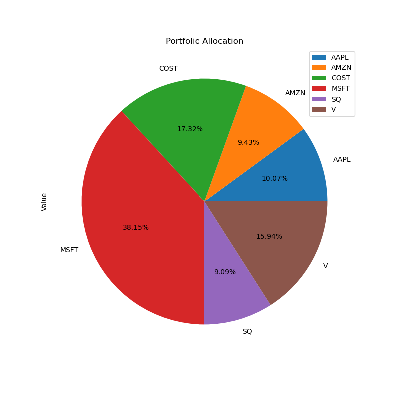

# InvestInspect Application

InvestInspect  is a practical application that utilizes yfinance library from python for financial data analysis and allows users to optimize their stock performance. The Application will ask the user to input the stock symbol, share amount, and current price using the GUI (Graphical User Interface) 
InvestInspect is more than just a portfolio tracker, it is a smart and comprehensive tool that helps you make informed and confident decisions about your investments. 

The information below illustrates a deep finanical analysis that will output stock information to make confident decisions about your portfolio. 

## Calculating  Portfolio Allocation 
Visualize your portfolio composition with a pie chart that shows the weights and values of each stock you hold.

## Daily and Cumulative Returns vs Market Benchmark
Helps you track the Daily and Cumulative return values on a daily basis and compare it with the  market benchmark. 

## Combined Returns for Portfolio vs Market Benchmark 
The combined return involves considering the various components that contribute to the overall performance of on investment. 

##  Annualized Returns of Assets 
Cumulative returns, annual returns, and excess annual returns help you measure the long-term performance of your portfolio and the compound effect of your daily returns. This can help you assess the growth potential of your portfolio and the impact of your investment decisions over time.

## Annualized Returns of Assets above the Risk Free rate 

## Expected Annual Returns vs Expected Annual Risks 
This analysis aims to identify the optimal portfolio that maximizes the Sharpe ratio, illustrating the delicate balance between potential returns and associated risks.

##  Standard deviation over 21 days 
Standard deviation of the portfolio helps you quantify the risk or uncertainty of your portfolio returns. This can help you understand the trade-off between risk and return and adjust your portfolio allocation accordingly.

## Excess Rolling Standard Deviation over 21 days 
Rolling standard deviation for 21 days helps you monitor the changing risk of your portfolio over time and capture the fluctuations in the market conditions. This can help you anticipate the volatility of your portfolio returns and manage your risk exposure.

## Sharpe Ratios
Sharpe ratio helps you evaluate the efficiency of your portfolio and the quality of your returns. This can help you optimize your portfolio by maximizing the return per unit of risk and choosing the best combination of assets.
 * image pending 

##  Correlation Matrix for Portfolio and Market Benchmark 
Correlation matrix helps you understand the diversification benefits of your portfolio and the interdependence of your assets. This can help you reduce the overall risk of your portfolio by selecting assets that have low or negative correlation with each other.

## Monte Carlo Simulation 
