# InvestInspect Application

InvestInspect  is a practical application that utilizes yfinance library from python for financial data analysis and allows users to optimize their stock performance. The Application will ask the user to input the stock symbol and share amount using the GUI (Graphical User Interface) 
InvestInspect is more than just a portfolio tracker, it is a smart and comprehensive tool that helps you make informed and confident decisions about your investments. 

The information below illustrates a deep financial analysis that will output stock information to make confident decisions about your portfolio. 

## Calculating  Portfolio Allocation 
Visualize your portfolio composition with a pie chart that shows the weights and values of each stock you hold.

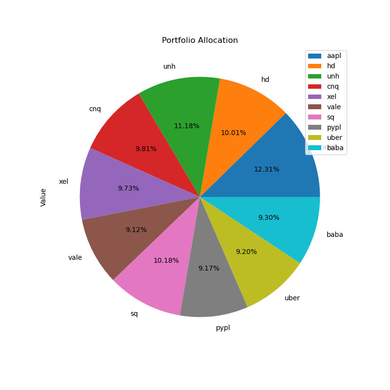

## Daily and Cumulative Returns vs Market Benchmark
Helps you track the Daily and Cumulative return values on a daily basis and compare it with the  market benchmark. 

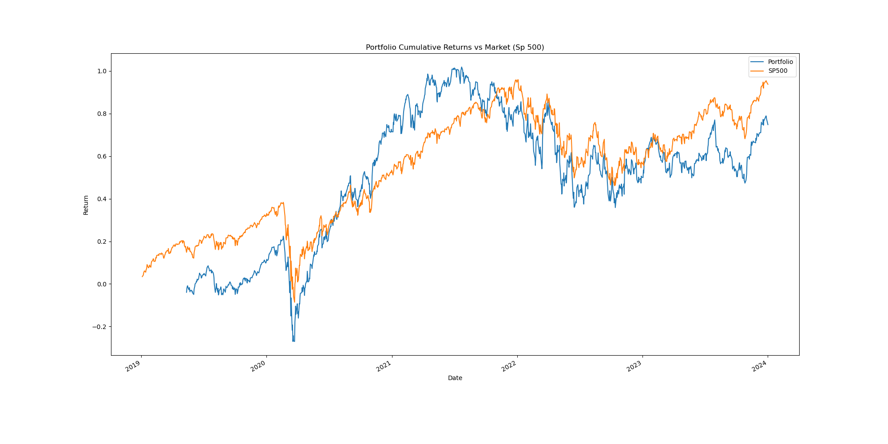
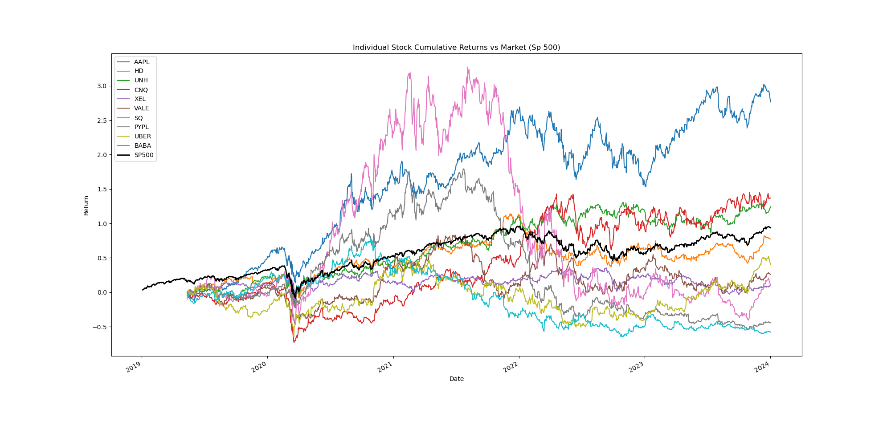

## Combined Returns for Portfolio vs Market Benchmark 
The combined return involves considering the various components that contribute to the overall performance of on investment. 

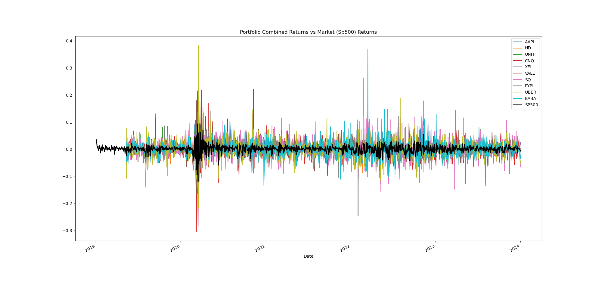

##  Annualized Returns of Assets 
Cumulative returns, annual returns, and excess annual returns help you measure the long-term performance of your portfolio and the compound effect of your daily returns. This can help you assess the growth potential of your portfolio and the impact of your investment decisions over time.

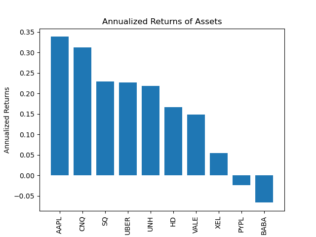

## Annualized Excess Returns of Assets above the risk-free rate

## Expected Annual Returns vs Expected Annual Risks 
This analysis aims to identify the optimal portfolio that maximizes the Sharpe ratio, illustrating the delicate balance between potential returns and associated risks.
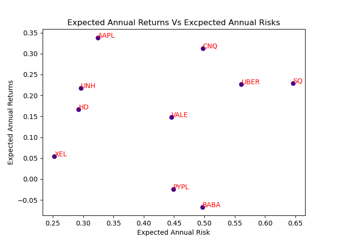

##  Standard deviation over 90 days 
Standard deviation of the portfolio helps you quantify the risk or uncertainty of your portfolio returns. This can help you understand the trade-off between risk and return and adjust your portfolio allocation accordingly.

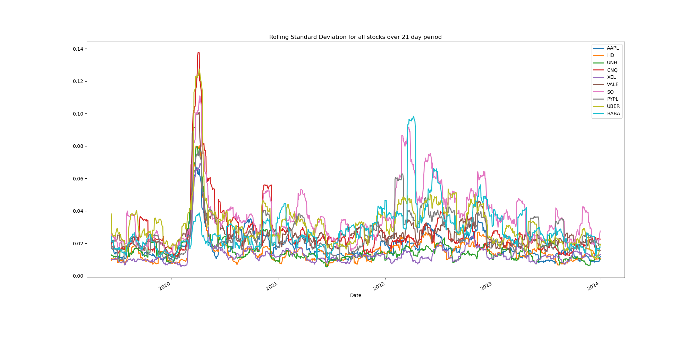

## Sharpe Ratios
Sharpe ratio helps you evaluate the efficiency of your portfolio and the quality of your returns. This can help you optimize your portfolio by maximizing the return per unit of risk and choosing the best combination of assets.
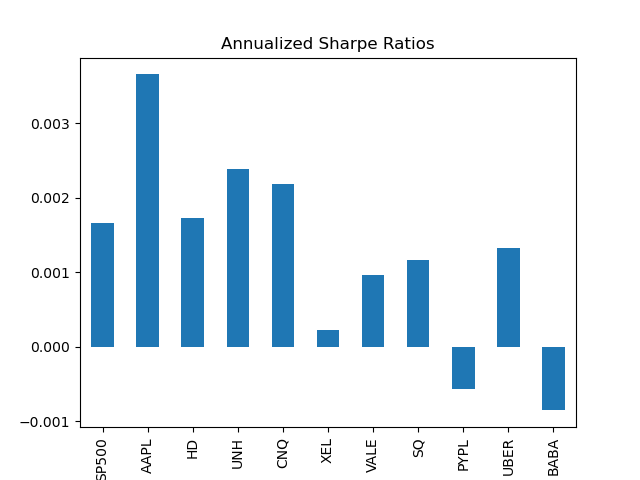

##  Correlation Matrix for Portfolio and Market Benchmark 
Correlation matrix helps you understand the diversification benefits of your portfolio and the interdependence of your assets. This can help you reduce the overall risk of your portfolio by selecting assets that have low or negative correlation with each other.

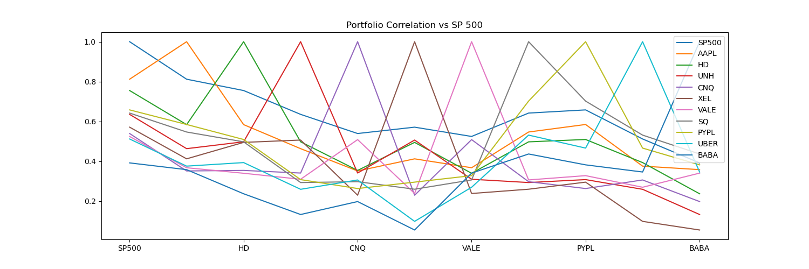

## Monte Carlo Simulation 
Monte Carlo simulation is a tool used to see how your investment will perform in the long run and runs past activity to make predictions. It measures the stocks volatility to assist the user  in to making informed decisions in regards to their portfolio. 

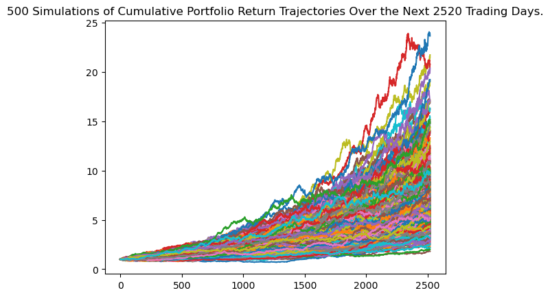
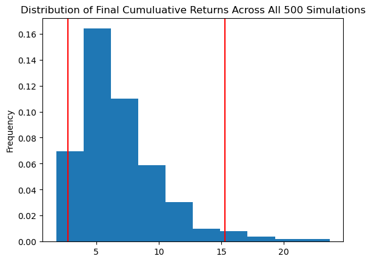

References:
[Tkinter](https://www.youtube.com/watch?v=0tM-l_ZsxjUz)
[Tkinter](https://www.youtube.com/watch?v=5qOnzF7RsNA)
[Yfinance library](https://www.youtube.com/watch?v=7wAQCwdvqqo)
[stackoverflow](https://stackoverflow.com)
[pandas](https://pandas.pydata.org/docs/user_guide/basics.html)

## Created by Kerim M. , Jahum M. , Daniela C. , Emmanuel N. 

Kerim  (Team leader)
Jahun ( GUI Interface )
Emmanuel (Beta Calculations)
Daniela (README file) 